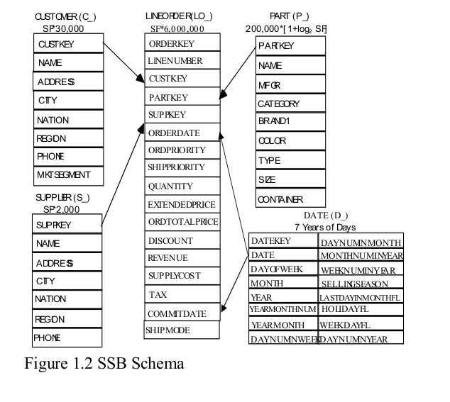

Crystal GPU Library
=================

The Crystal library implements a collection of block-wide device functions that can be used to implement high performance implementations of SQL queries on GPUs.

The package contains:

* Crystal: `crystal/` contains the block-wide device functions
* Implementations: `src/` contains SQL query operator implementations and implementations of 13 queries of the Star Schema Benchmark

For full details of the Crystal, see our [paper](http://anilshanbhag.in/static/papers/crystal_sigmod20.pdf)

```
@inproceedings{shanbhag2020crystal,
  author = {Shanbhag, Anil and Madden, Samuel and Yu, Xiangyao},
  title = {A Study of the Fundamental Performance Characteristics of GPUs and CPUs for Database Analytics},
  year = {2020},
  url = {https://doi.org/10.1145/3318464.3380595},
  doi = {10.1145/3318464.3380595},
  booktitle = {Proceedings of the 2020 ACM SIGMOD International Conference on Management of Data},
  pages = {1617–1632},
  numpages = {16},
  location = {Portland, OR, USA},
  series = {SIGMOD ’20}
}
```

Usage
----

To use Crystal:

* Copy out the `crystal` directory into your project.
* Include Crystal
```
#include "crystal/crystal.cuh"
```
* Add the crystal directory to your include path

To run the operator implementations:

* Compile and run the operator. E.g.,
```
make bin/ops/project
./bin/ops/project
```

To run the Star Schema Benchmark implementation:

* Generate the test dataset

```
cd test/

# Generate the test generator / transformer binaries
cd ssb/dbgen
make
cd ../loader
make 
cd ../../

# Generate the test data and transform into columnar layout
# Substitute <SF> with appropriate scale factor (eg: 1)
python util.py ssb <SF> gen
python util.py ssb <SF> transform
```

* Configure the benchmark settings
```
cd src/ssb/
# Edit SF and BASE_PATH in ssb_utils.h
```

* To run a query, say run q11
```
make bin/ssb/q11
./bin/ssb/q11
```


**Table Schema of SSB**




## 4. Query

Here is a list of SSB queries, the query parameter may be different between different *scale factor*. The sample data is generated randomly. 

*Notice that the queries may be slightly different for different scale factor in the filtering constants. The queries below are tested with scale factor 10.*

##### Q1.1

```sql
select sum(v_revenue) as revenue
from p_lineorder
left join dates on lo_orderdate = d_datekey
where d_year = 1993
and lo_discount between 1 and 3
and lo_quantity < 25;
```

##### Q1.2

```sql
select sum(v_revenue) as revenue
from p_lineorder
left join dates on lo_orderdate = d_datekey
where d_yearmonthnum = 199401
and lo_discount between 4 and 6
and lo_quantity between 26 and 35;
```
##### Q1.3

```sql
select sum(v_revenue) as revenue
from p_lineorder
left join dates on lo_orderdate = d_datekey
where d_weeknuminyear = 6 and d_year = 1994
and lo_discount between 5 and 7
and lo_quantity between 26 and 35;
```
##### Q2.1

```sql
select sum(lo_revenue) as lo_revenue, d_year, p_brand
from p_lineorder
left join dates on lo_orderdate = d_datekey
left join part on lo_partkey = p_partkey
left join supplier on lo_suppkey = s_suppkey
where p_category = 'MFGR#12' and s_region = 'AMERICA'
group by d_year, p_brand
order by d_year, p_brand;
```
##### Q2.2

```sql
select sum(lo_revenue) as lo_revenue, d_year, p_brand
from p_lineorder
left join dates on lo_orderdate = d_datekey
left join part on lo_partkey = p_partkey
left join supplier on lo_suppkey = s_suppkey
where p_brand between 'MFGR#2221' and 'MFGR#2228' and s_region = 'ASIA'
group by d_year, p_brand
order by d_year, p_brand;
```
##### Q2.3

```sql
select sum(lo_revenue) as lo_revenue, d_year, p_brand
from p_lineorder
left join dates on lo_orderdate = d_datekey
left join part on lo_partkey = p_partkey
left join supplier on lo_suppkey = s_suppkey
where p_brand = 'MFGR#2239' and s_region = 'EUROPE'
group by d_year, p_brand
order by d_year, p_brand;
```
##### Q3.1

```sql
select c_nation, s_nation, d_year, sum(lo_revenue) as lo_revenue
from p_lineorder
left join dates on lo_orderdate = d_datekey
left join customer on lo_custkey = c_custkey
left join supplier on lo_suppkey = s_suppkey
where c_region = 'ASIA' and s_region = 'ASIA'and d_year >= 1992 and d_year <= 1997
group by c_nation, s_nation, d_year
order by d_year asc, lo_revenue desc;
```
##### Q3.2

```sql
select c_city, s_city, d_year, sum(lo_revenue) as lo_revenue
from p_lineorder
left join dates on lo_orderdate = d_datekey
left join customer on lo_custkey = c_custkey
left join supplier on lo_suppkey = s_suppkey
where c_nation = 'UNITED STATES' and s_nation = 'UNITED STATES'
and d_year >= 1992 and d_year <= 1997
group by c_city, s_city, d_year
order by d_year asc, lo_revenue desc;
```
##### Q3.3

```sql
select c_city, s_city, d_year, sum(lo_revenue) as lo_revenue
from p_lineorder
left join dates on lo_orderdate = d_datekey
left join customer on lo_custkey = c_custkey
left join supplier on lo_suppkey = s_suppkey
where (c_city='UNITED KI1' or c_city='UNITED KI5')
and (s_city='UNITED KI1' or s_city='UNITED KI5')
and d_year >= 1992 and d_year <= 1997
group by c_city, s_city, d_year
order by d_year asc, lo_revenue desc;
```
##### Q3.4

```sql
select c_city, s_city, d_year, sum(lo_revenue) as lo_revenue
from p_lineorder
left join dates on lo_orderdate = d_datekey
left join customer on lo_custkey = c_custkey
left join supplier on lo_suppkey = s_suppkey
where (c_city='UNITED KI1' or c_city='UNITED KI5') and (s_city='UNITED KI1' or s_city='UNITED KI5') and d_yearmonth = 'Dec1997'
group by c_city, s_city, d_year
order by d_year asc, lo_revenue desc;
```
##### Q4.1

```sql
select d_year, c_nation, sum(lo_revenue) - sum(lo_supplycost) as profit
from p_lineorder
left join dates on lo_orderdate = d_datekey
left join customer on lo_custkey = c_custkey
left join supplier on lo_suppkey = s_suppkey
left join part on lo_partkey = p_partkey
where c_region = 'AMERICA' and s_region = 'AMERICA' and (p_mfgr = 'MFGR#1' or p_mfgr = 'MFGR#2')
group by d_year, c_nation
order by d_year, c_nation;
```
##### Q4.2

```sql
select d_year, s_nation, p_category, sum(lo_revenue) - sum(lo_supplycost) as profit
from p_lineorder
left join dates on lo_orderdate = d_datekey
left join customer on lo_custkey = c_custkey
left join supplier on lo_suppkey = s_suppkey
left join part on lo_partkey = p_partkey
where c_region = 'AMERICA'and s_region = 'AMERICA'
and (d_year = 1997 or d_year = 1998)
and (p_mfgr = 'MFGR#1' or p_mfgr = 'MFGR#2')
group by d_year, s_nation, p_category
order by d_year, s_nation, p_category;
```
##### Q4.3

```sql
select d_year, s_city, p_brand, sum(lo_revenue) - sum(lo_supplycost) as profit
from p_lineorder
left join dates on lo_orderdate = d_datekey
left join customer on lo_custkey = c_custkey
left join supplier on lo_suppkey = s_suppkey
left join part on lo_partkey = p_partkey
where c_region = 'AMERICA'and s_nation = 'UNITED STATES'
and (d_year = 1997 or d_year = 1998)
and p_category = 'MFGR#14'
group by d_year, s_city, p_brand
order by d_year, s_city, p_brand;
```
